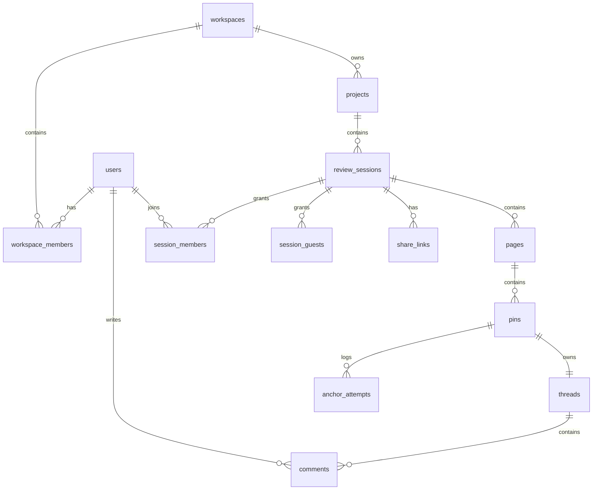

# Database ERD

## 1. Recommended Database

MVP can use Supabase Postgres with Supabase Auth and Realtime.

Reasons:

- Relational model fits workspace/project/session/thread structure.
- Realtime channels support collaboration events.
- Row Level Security can protect workspace and session data.

## 2. ERD



## 3. Tables

### users

Supabase Auth owns identity. A public profile table can mirror needed fields.

| Column | Type | Notes |
| --- | --- | --- |
| `id` | uuid pk | Matches auth user id. |
| `email` | text | Unique when available. |
| `display_name` | text | User visible name. |
| `avatar_url` | text nullable | Avatar. |
| `created_at` | timestamptz | Created time. |

### workspaces

| Column | Type | Notes |
| --- | --- | --- |
| `id` | uuid pk | Workspace id. |
| `name` | text | Workspace name. |
| `plan` | text | free, pro, team, agency, enterprise. |
| `created_by` | uuid fk users.id | Creator. |
| `created_at` | timestamptz | Created time. |
| `updated_at` | timestamptz | Updated time. |

### workspace_members

| Column | Type | Notes |
| --- | --- | --- |
| `id` | uuid pk | Member id. |
| `workspace_id` | uuid fk | Workspace. |
| `user_id` | uuid fk | User. |
| `role` | text | admin, editor, commenter, viewer. |
| `created_at` | timestamptz | Joined time. |

Unique index:

- `(workspace_id, user_id)`

### projects

| Column | Type | Notes |
| --- | --- | --- |
| `id` | uuid pk | Project id. |
| `workspace_id` | uuid fk | Parent workspace. |
| `name` | text | Project name. |
| `description` | text nullable | Optional. |
| `allowed_domains` | text[] | Optional domain allowlist. |
| `created_by` | uuid fk users.id | Creator. |
| `created_at` | timestamptz | Created time. |
| `updated_at` | timestamptz | Updated time. |

### review_sessions

| Column | Type | Notes |
| --- | --- | --- |
| `id` | uuid pk | Session id. |
| `project_id` | uuid fk | Parent project. |
| `name` | text | Session name. |
| `status` | text | draft, active, archived. |
| `created_by` | uuid fk users.id | Creator. |
| `default_environment` | text nullable | production, staging, localhost, custom. |
| `created_at` | timestamptz | Created time. |
| `updated_at` | timestamptz | Updated time. |
| `archived_at` | timestamptz nullable | Archive time. |

Guest-session MVP columns:

| Column | Type | Notes |
| --- | --- | --- |
| `password_hash` | text nullable | Hashed join password for account-free sessions. |
| `invite_secret_hash` | text nullable | Hashed invite capability token secret. |
| `owner_token_hash` | text nullable | Hashed owner capability token. |
| `closed_at` | timestamptz nullable | Close time for guest Review Sessions. |

### session_members

Optional for MVP if workspace role is enough. Useful for share-link permissions.

| Column | Type | Notes |
| --- | --- | --- |
| `id` | uuid pk | Row id. |
| `session_id` | uuid fk | Session. |
| `user_id` | uuid fk | User. |
| `role` | text | admin, editor, commenter, viewer. |
| `created_at` | timestamptz | Added time. |

### session_guests

Guests are account-free identities scoped to one Review Session.

| Column | Type | Notes |
| --- | --- | --- |
| `id` | uuid pk | Guest id. |
| `session_id` | uuid fk | Session. |
| `display_name` | text | Guest visible name. |
| `token_hash` | text | Hashed guest capability token. |
| `status` | text | active, removed. |
| `created_at` | timestamptz | Joined time. |
| `last_seen_at` | timestamptz nullable | Last activity time. |
| `removed_at` | timestamptz nullable | Removal time. |

### pages

| Column | Type | Notes |
| --- | --- | --- |
| `id` | uuid pk | Page id. |
| `session_id` | uuid fk | Parent session. |
| `page_key` | text | Normalized page identity. |
| `latest_url` | text | Most recent actual URL. |
| `hostname` | text | Captured hostname. |
| `pathname` | text | Captured path. |
| `title` | text nullable | Document title. |
| `fingerprint` | jsonb | DOM hash, app version, viewport data. |
| `environment` | text nullable | production, staging, localhost. |
| `created_at` | timestamptz | Created time. |
| `updated_at` | timestamptz | Updated time. |

Unique index:

- `(session_id, page_key)`

### pins

Actor fields use session-scoped actors so both registered users and account-free guests can author review activity.

Recommended actor shape:

- `actor_type`: user or guest.
- `actor_id`: users.id when `actor_type` is user; session_guests.id when `actor_type` is guest.

| Column | Type | Notes |
| --- | --- | --- |
| `id` | uuid pk | Pin id. |
| `page_id` | uuid fk | Page. |
| `created_by_type` | text | user or guest. |
| `created_by_id` | uuid | Creator id from users or session_guests. |
| `anchor` | jsonb | Hybrid anchor payload. |
| `viewport_position` | jsonb | X/Y in viewport at creation. |
| `document_position` | jsonb | X/Y in document at creation. |
| `status` | text | attached, recovered, approximate, lost. |
| `anchor_revision` | integer | Starts at 1 and increments after each confirmed reposition. |
| `moved_by_type` | text nullable | user or guest. |
| `moved_by_id` | uuid nullable | Most recent actor who manually repositioned the pin. |
| `moved_at` | timestamptz nullable | Most recent confirmed reposition time. |
| `created_at` | timestamptz | Created time. |
| `updated_at` | timestamptz | Updated time. |

### threads

| Column | Type | Notes |
| --- | --- | --- |
| `id` | uuid pk | Thread id. |
| `pin_id` | uuid fk unique | One thread per pin. |
| `status` | text | open, resolved, reopened. |
| `resolved_by_type` | text nullable | user or guest. |
| `resolved_by_id` | uuid nullable | Resolver id from users or session_guests. |
| `resolved_at` | timestamptz nullable | Resolve time. |
| `created_at` | timestamptz | Created time. |
| `updated_at` | timestamptz | Updated time. |

### comments

Use one table for original comment and replies.

| Column | Type | Notes |
| --- | --- | --- |
| `id` | uuid pk | Comment id. |
| `thread_id` | uuid fk | Parent thread. |
| `parent_comment_id` | uuid nullable fk comments.id | Null for first comment. |
| `author_type` | text | user or guest. |
| `author_id` | uuid | Author id from users or session_guests. |
| `body` | text | Plain text body. |
| `created_at` | timestamptz | Created time. |
| `updated_at` | timestamptz | Updated time. |
| `deleted_at` | timestamptz nullable | Soft delete, V2. |

### share_links

| Column | Type | Notes |
| --- | --- | --- |
| `id` | uuid pk | Link id. |
| `session_id` | uuid fk | Session. |
| `token_hash` | text | Hashed token. |
| `access_mode` | text | member_only, link_with_login, public_guest. |
| `expires_at` | timestamptz nullable | Expiration. |
| `created_by` | uuid fk users.id | Creator. |
| `created_at` | timestamptz | Created time. |

### anchor_attempts

Optional but recommended for anchor recovery metrics.

| Column | Type | Notes |
| --- | --- | --- |
| `id` | uuid pk | Attempt id. |
| `pin_id` | uuid fk | Pin. |
| `strategy` | text | selector, xpath, text, similarity, fallback. |
| `result` | text | success, approximate, failed. |
| `score` | numeric nullable | Confidence score. |
| `created_at` | timestamptz | Attempt time. |

## 4. Anchor JSON Shape

```json
{
  "url": "https://example.com/product",
  "pageKey": "/product",
  "mode": "element",
  "selector": "main section:nth-child(2) button.primary",
  "xpath": "/html/body/main/section[2]/button",
  "domPath": ["HTML", "BODY", "MAIN", "SECTION", "BUTTON"],
  "textContent": "Start trial",
  "textOffset": 0,
  "elementRect": {
    "x": 120,
    "y": 340,
    "width": 160,
    "height": 44
  },
  "clickOffset": {
    "xRatio": 0.5,
    "yRatio": 0.5
  },
  "viewport": {
    "width": 1440,
    "height": 900,
    "scrollX": 0,
    "scrollY": 280
  },
  "manualPosition": false
}
```

`mode` is `element` when the drop point resolves to a meaningful element and `page` when the user intentionally places the pin on page background. Repositioning replaces the complete anchor payload, increments `anchor_revision`, and preserves the related thread and comments.

## 5. Indexes

Recommended indexes:

- `workspace_members(workspace_id, user_id)`
- `projects(workspace_id)`
- `review_sessions(project_id, status)`
- `pages(session_id, page_key)`
- `pins(page_id, status)`
- `threads(pin_id, status)`
- `comments(thread_id, created_at)`
- `share_links(session_id)`

## 6. Row Level Security

MVP policies:

- Users can read workspaces where they are members.
- Users can read projects in accessible workspaces.
- Users can read sessions in accessible projects.
- Commenters and above can create pins and comments.
- Editors and above can resolve threads.
- Admins can manage members and sessions.

## 7. Realtime Channels

Recommended channel names:

- `workspace:{workspace_id}`
- `project:{project_id}`
- `session:{session_id}`
- `thread:{thread_id}`

MVP can subscribe primarily to `session:{session_id}`.
